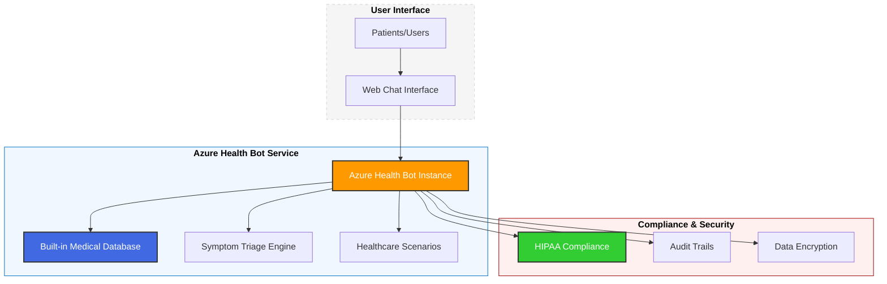

# Architectural Deep Dive

```mermaid
graph TB
    subgraph UI ["<b style='color:black'>User Interface</b>"]
        USER[Patients/Users]
        WEB[Web Chat Interface]
    end
    
    subgraph Service ["<b style='color:black'>Azure Health Bot Service</b>"]
        HEALTHBOT[Azure Health Bot Instance]
        MEDICAL[Built-in Medical Database]
        TRIAGE[Symptom Triage Engine]
        SCENARIOS[Healthcare Scenarios]
    end
    
    subgraph Security ["<b style='color:black'>Compliance & Security</b>"]
        HIPAA[HIPAA Compliance]
        AUDIT[Audit Trails]
        ENCRYPT[Data Encryption]
    end
    
    %% Connections
    USER --> WEB
    WEB --> HEALTHBOT
    HEALTHBOT --> MEDICAL
    HEALTHBOT --> TRIAGE
    HEALTHBOT --> SCENARIOS
    HEALTHBOT --> HIPAA
    HEALTHBOT --> AUDIT
    HEALTHBOT --> ENCRYPT
    
    %% Node Styling
    style HEALTHBOT fill:#FF9900,stroke:#333,stroke-width:2px,color:#fff
    style HIPAA fill:#32CD32,stroke:#333,stroke-width:2px,color:#fff
    style MEDICAL fill:#4169E1,stroke:#333,stroke-width:2px,color:#fff
    
    %% Box Styling
    style UI fill:#f5f5f5,stroke:#d2d2d2,stroke-dasharray: 5 5
    style Service fill:#f0f7ff,stroke:#0072c6,stroke-width:1px
    style Security fill:#fff0f0,stroke:#a10000,stroke-width:1px
```