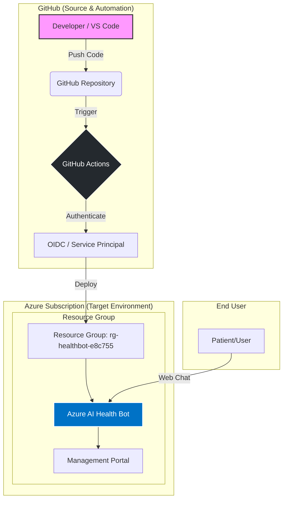

# Architectural Deep Dive

```mermaid
graph TD
    subgraph "GitHub (Source & Automation)"
        A[Developer / VS Code] -->|Push Code| B(GitHub Repository)
        B -->|Trigger| C{GitHub Actions}
        C -->|Authenticate| D[OIDC / Service Principal]
    end

    subgraph "Azure Subscription (Target Environment)"
        D -->|Deploy| E[Resource Group: rg-healthbot-e8c755]
        subgraph "Resource Group"
            E --> F[Azure AI Health Bot]
            F --> G[Management Portal]
        end
    end

    subgraph "End User"
        H[Patient/User] -->|Web Chat| F
    end

    %% Styling
    style A fill:#f9f,stroke:#333,stroke-width:2px
    style F fill:#0072C6,stroke:#fff,stroke-width:2px,color:#fff
    style C fill:#24292e,stroke:#fff,color:#fff
```